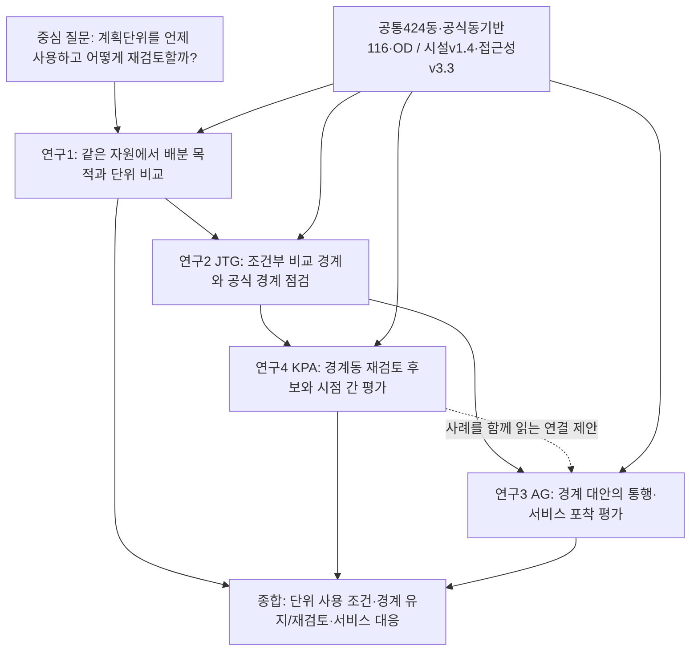

# 박사논문 통합 설계안

2026-09-29 · 최신 연구 설계에 근거한 토의용 초안

**추천 배열은 연구1 → 연구2(JTG) → 연구4(KPA) → 연구3(AG)이다.** 중심 질문은 “생활권이 필요한가”에서 출발하되, 답을 미리 정하지 않고 **“어떤 조건에서 생활권을 중간 계획단위로 사용할 가치가 있으며, 그 경계를 언제·어떻게 재검토해야 하는가”**로 확장한다.

연구1은 같은 자원을 배분할 때 단위가 하는 일을 시험한다. JTG는 이동 자료로 비교 경계를 만들고 공식 경계를 점검하는 기준을 제공한다. KPA는 그 점검을 경계동의 재검토 후보와 시점 간 평가로 구체화한다. AG는 경계를 조정하는 경로에서 통행 포착과 서비스 포착이 함께 좋아지는지, 누구에게 누락이 늘어나는지를 살핀다. 마지막 결론은 “이동 경계로 교체하자”가 아니라, **최소보장을 책임질 단위와 그 단위를 점검할 증거를 어떻게 함께 사용할 것인가**이다.

이 문서는 중앙 기준 문서를 대체하지 않는다. 아래의 **기존**은 중앙 문서·9/21 지도 내용, **현재 확인**은 각 연구의 최신 문서와 대화에서 확인한 설계, **제안**은 이번 통합 작업의 판단이다. 연구 결과의 최종 확정과 교수님 승인은 별도다. 근거 ID와 확인 시점은 같은 폴더의 [근거표](근거표.md)에 정리했다.

## 1. 전체 논지가 어떻게 바뀌었는가

중앙의 기존 흐름은 “필요성 → 구획·점검 → 접근성으로 불일치 설명 → 시간 변화 진단”이었다. 현재 연구들은 ‘설명 회귀’보다 **계획 대안의 비교와 진단 절차**를 발전시키고 있다. 따라서 전체 논문도 불일치의 단일 원인을 찾는 구조에서, 계획단위의 사용 조건·점검·재검토·선택의 결과를 평가하는 구조로 옮기는 편이 일관된다. [C01, C02, R1, R2, R3, R4]

| 부분 | 중앙의 기존 설계 | 현재 확인된 설계 변화 | 전체 논지에 주는 변화 | 근거 |
|---|---|---|---|---|
| 연구1 · 필요성 | 같은 자원에서 격자·동·생활권·구의 효율·형평 비교. 행정 효율은 문헌·제도 논의 | 생활권 없는 **격자 형평 대조군**을 두고, 효율 목적과 최소보장 집계단위의 효과를 분리. 경계는 배분의 책임 단위이며 실제 이동을 막는 장벽이 아님 | 형평 개선만으로 생활권 필요성을 주장할 수 없음. 격자 형평으로도 달성 가능한 것과 중간단위의 추가 역할을 나눠 검증 | C01, R1 |
| 연구2 · JTG | 구획 방법 재확인과 공식 생활권 점검. 게재본 재현 검토 | 게재 연구 자체가 이미 공식 경계 벤치마킹·진단을 포함. 학위논문 연구2는 424동·공통 OD·co-association 합의법으로 재분석 중 | ‘새 경계를 만들었다’보다 **제도 조건 아래 공식 경계를 점검하는 재현 가능한 비교 기준**에 기여를 둠. 게재본과 현재 방법을 구별 | R2, D02 |
| 연구3 · AG | ΔIFR와 ΔMAI·ΔCOV의 관련성 회귀로 접근성이 불일치를 설명하는지 검토 | v3는 크기 제약 아래 경계 재배정 경로, 통행 포착과 서비스 누락, 이동동·영향받는 다른 동의 분해 중심 | 불일치의 원인을 입증하는 장에서 **경계 대안을 선택할 때 생기는 서비스 측면의 차이와 분배**를 평가하는 장으로 이동 | R3 |
| 연구4 · KPA | 2020·2025 불일치 변화와 재정비 대상 진단 | 조건부 벤치마크, 경계동 후보 선별, 단일·순차 재배정, 시점 간 점검, 사례를 결합한 v2 후보안 | ‘불일치가 늘었나’에서 **어떤 동을 우선 재검토하고 후보가 얼마나 견고한가**로 구체화. 질문·분모 변경의 교수 승인 미정 | R4 |
| 공통 자료 | 시설 33종·A8범주, 이전 접근성 정의·경로 설명 일부 잔존 | facility-v1.4: 분석27종·A7범주+통제5종, 체육시설업 제외. 접근성 v3.3. 동일 424동 기반 공식 경계 사용 | 새 범주·분모에 맞춘 재분석을 연결해야 함. 구8범주 수치를 신7범주 결과나 물리적 시계열 변화로 읽지 않음 | D01–D05 |
| 종합 · 이번 제안 | 필요성→구획→원인→변화 | 사용 조건→비교 기준→재검토 후보→서비스를 고려한 선택 | **중간 계획단위의 조건부 적합성과 재검토 체계**를 논문의 중심 기여로 삼음 | 본 초안의 제안 |

**가제(제안): 「생활권을 중간 계획단위로 사용하는 조건과 재검토 방법 — 자원배분, 이동 정합성, 서비스 포착의 통합 평가」**

‘생활권의 우월성’이나 ‘최적 경계’를 제목에 전제하지 않는다. 서울은 방법을 적용하고 한계를 확인하는 사례이며, 서울의 116개가 모든 도시에서 성립하는 규모라는 뜻도 아니다.

## 2. 중심 질문과 증거로 지지해야 할 주장

### 중심 연구질문

> 동일한 자원과 관측 가능한 이동·서비스 여건 아래, 중간 계획단위는 어떤 배분 목표를 구현하는 데 유용하며, 그 경계의 재검토 필요성과 대안의 영향을 어떻게 평가할 수 있는가?

### 중심 주장 후보

생활권은 주민의 이동을 안에 가두는 공간이 아니라, 여러 지역의 최소 서비스 수준과 자원배분을 논의할 **책임·조정 단위**로 사용할 수 있다. 다만 그 가치는 격자 수준의 형평 정책 및 다른 집계단위와 공정하게 비교해 확인해야 한다. 공식 경계는 이동 자료로 만든 조건부 비교 경계와 주기적으로 대조할 수 있으나, 통행 정합성이 높아진다는 이유만으로 변경을 정당화할 수 없다. 재검토 대상의 안정성과 서비스 포착의 분배적 영향을 함께 평가해야 한다.

이 주장을 지지하려면 다음 세 조건을 충족해야 한다.

1. **배분 조건:** 연구1에서 목적함수 효과와 단위 효과를 분리하고, 중간단위의 이익과 효율 손실·단위 내부의 잔여 취약성을 모두 보인다. 행정적 협의비용 감소는 실제 측정 또는 문헌 근거가 없으면 실증 성과로 주장하지 않는다.
2. **진단 조건:** JTG·KPA에서 자료·구획 제약·지표 분모를 명시하고, 진단 결과가 크기 효과·동 내부통행·같은 자료에 대한 최적화에 얼마나 의존하는지 보인다.
3. **선택 조건:** AG에서 통행 포착 개선과 서비스 누락 감소를 별도로 평가하며, 총합뿐 아니라 영향을 받는 집단의 손익을 보여준다. 경계 재배정으로 바뀐 계산값을 실제 시설 개선으로 표현하지 않는다.

| 연구 | 고유한 하위 질문 | 답을 다음 논의에 연결하는 방식 | 여기서 답하지 않는 것 |
|---|---|---|---|
| 연구1 | 같은 예산에서 **무엇을 최소보장하고 어느 단위로 책임질 것인가**에 따라 배분이 어떻게 달라지는가? | 계획단위를 사용할 목적과 성과 기준을 제공 | 현재 116권역의 유일한 최적성, 협의비용의 실측 효과 |
| 연구2 · JTG | 제도적 제약을 명시한 이동 기반 구획으로 공식 경계를 **어떻게 비교·점검할 것인가**? | 공통 경계·진단 지표·재현성 기준 제공 | 이동 구획이 곧 채택해야 할 계획안이라는 결론 |
| 연구4 · KPA | 공식 경계에서 **어느 경계동을 먼저 재검토하고**, 그 후보를 다른 시점에서 어떻게 평가할 것인가? | 재검토의 우선순위와 후속 사례의 질문 제공 | 모든 불일치의 원인, 자동 경계 변경, 미래예측의 확정 성능 |
| 연구3 · AG | 경계 대안을 따라갈 때 **통행 포착과 서비스 포착·누락이 어떻게 바뀌고 누구에게 집중되는가**? | 변경·유지·공동서비스 등 대응을 구별할 판단 근거 제공 | 시설 이용의 인과효과, 실제 주민 후생, 서비스 투자 최적안 |

## 3. 본문 배열 추천과 대안

| 배열 | 장점 | 현재 설계에서의 약점 | 판단 |
|---|---|---|---|
| **1 → 2(JTG) → 4(KPA) → 3(AG)** | 사용 목적 → 비교 기준 → 재검토 대상 → 서비스 측면의 선택으로 이어짐. 마지막 실증에서 경계 변경의 이익·비용을 함께 다룸 | 9/21 기본 순서와 달라 교수님에게 변경 이유 설명 필요. KPA의 사례 접근성은 보조로 제한해야 AG를 미리 반복하지 않음 | **권장하는 통합 초안** |
| 1 → 2(JTG) → 3(AG) → 4(KPA) | 교수님이 제시한 기본 순서 유지. ‘접근성 관련성→시간 변화’라면 자연스러움 | 현재 AG가 경계 선택의 결과 평가로 발전했으므로 마지막이 다시 후보 진단으로 돌아감 | 순서 유지가 필요하면 가능. KPA를 마지막 ‘주기적 점검’으로 좁혀 역할 정리 |
| 2(JTG) → 4(KPA) → 3(AG) → 1 | 이미 성립한 실증 연구들을 먼저 보여줄 수 있음 | “왜 생활권을 쓰나”라는 핵심 반론을 끝까지 유예함 | 권하지 않음 |

**연구번호·폴더는 유지한다.** 권장안의 4장 절번호만 4.1=연구1, 4.2=연구2, 4.3=연구4, 4.4=연구3으로 한다. 중앙 README·기준 설계의 담당 관계를 이 초안에서 바꾸지 않는다.

이 순서는 **논리적 독해 순서**다. KPA가 뽑은 후보를 AG가 실제 계산 입력으로 받았다는 뜻이 아니다. 두 연구는 공식 경계와 공통 자료에서 출발하는 별도 분석이다. 둘을 같은 사례로 나란히 읽는 연결은 추가 제안이며, 후보·이동 경로가 일치하는지는 각 연구의 새 산출물로 확인해야 한다.



## 4. 교수님 기본 5장 틀에 맞춘 목차

### 제1장 서론

1.1 중간 계획단위의 실효성이라는 문제: 격자 기반 분석만으로 충분한가  
1.2 연구 목적과 중심 질문: 배분 목표·이동 정합성·서비스 포착  
1.3 연구 범위와 사례: 서울, 공통 424동, 2020·2025의 관측 범위  
1.4 연구 구성과 기여: 네 연구가 서로 다른 판단 단계에 답하는 구조

### 제2장 이론적 배경 및 선행연구

2.1 중간 계획단위의 목적과 자원배분: 효율·형평·충분성, 공간 집계 효과, 책임·협의, 해외 제도의 목적·권한·효과 근거  
2.2 기능지역 구획과 공식 계획경계 점검: 이동 기반 군집, 제약된 구획, 합의·안정성, 비교 지표  
2.3 계획경계의 재검토와 시간 변화: 경계동, 국소 재배정, 우선순위 진단, 고정·갱신 경계 및 시점 간 검증  
2.4 경계와 서비스 포착: 잠재 접근성, 경계 조건, 서비스 누락, 다목적 선택, 공간적 파급·분배  
2.5 선행연구의 공백과 본 논문의 위치

### 제3장 분석의 틀

3.1 개념 구분과 네 연구의 연결: 분석 격자·책임 경계·이동 진단 경계  
3.2 공통 자료와 출처: OD, 경계, 인구, 시설, 보행망, 버전·한계  
3.3 공통 지표·분모·집계 규칙 및 해석 대상  
3.4 연구별 비교 설계: 배분 모의실험, 구획 벤치마크, 후보 진단, 경계 대안 평가  
3.5 검증과 민감도: 공통 입력 일치, 시점·규모·선정 편향, 계산 불확실성  
3.6 결과 통합 규칙: 일관된 결론을 강요하지 않고 조건별 판단으로 연결

### 제4장 분석결과

4.1 **연구1:** 계획단위와 자원배분 — 기준 분포, 효율·격자 형평 대조, 동·생활권·구 최소보장, 이익·비용 및 실현 가능성  
4.2 **연구2/JTG:** 이동 기반 구획과 공식 경계 점검 — 게재 연구와 현재 재분석 구별, 제약과 합의, 벤치마킹, 공간적 차이와 안정성  
4.3 **연구4/KPA:** 경계동 재검토 후보와 시점 간 평가 — 조건부 기준, 단일 후보, 순차 재배정, 정태·동태 점검, 사례  
4.4 **연구3/AG:** 경계 재배정의 통행·서비스 포착 — 제약된 비교 경로, 서비스 누락, 이동동과 다른 영향동, 민감도·사례  
4.5 **연결 해석:** 단위 사용 조건과 경계·서비스 대응의 구분(새 계산 모듈이나 다섯 번째 연구가 아닌 네 결과의 짧은 종합)

### 제5장 결론

5.1 중심 질문에 대한 조건부 답과 연구별 기여  
5.2 계획적 함의: 배분 책임, 경계 재검토, 공동서비스·시설 개선의 구별  
5.3 한계: 두 시점, 자료 대리, 선택된 이동, 시설 개수, 제약된 탐색  
5.4 후속 검증: 다른 도시·시기, 실제 이용·운영 자료, 협의비용과 정책 시행 평가

| 2장 절 | 4장 대응 | 문헌에서 확보할 논거 | 실증에서 확인할 것 |
|---|---|---|---|
| 2.1 목적·자원배분 | 4.1 연구1 | 충분성과 격자 형평도 대안이 될 수 있음. 해외 제도의 존재와 효과를 구별 | 형평 목적의 효과와 단위의 추가 효과·효율 비용 |
| 2.2 구획·공식 경계 점검 | 4.2 JTG | 기능지역을 제도 경계의 조건부 비교 기준으로 쓰는 논리 | 공통 자료에서 구획·비교가 재현되는가 |
| 2.3 재검토·시간 변화 | 4.3 KPA | 국소 조정·후보 순위·시점 간 평가의 구별 | 후보 선별의 추가 정보와 지속성·변동성 |
| 2.4 서비스 포착·대안 선택 | 4.4 AG | 물리적 도달과 경계 내 포착의 구별, 다목적 선택·분배 | 통행 포착 개선과 서비스 누락 변화의 관계·영향 집단 |
| 2.5 공백 종합 | 4.5 및 5장 | 한 지표로 단위 필요성·경계 타당성·서비스 개선을 모두 판단할 수 없음 | 어느 판단을 어떤 증거까지 뒷받침하는가 |

선행연구 폴더에는 해외 사례 외에도 절별 검색식·검색일·편수·제외 사유를 기록하는 방향이 이미 있다. 이번 변경은 그 체계적 검색을 폐기하는 것이 아니라 2.3/2.4의 질문과 실증 대응을 갱신하는 제안이다. 해외 제도가 있다는 사실만으로 행정 효율이 검증됐다고 쓰지 않는다. [L01]

## 5. 이번 통합안이 사용하는 공통 데이터 기준

| 자료 | 현재 기준 | 설계상 의미와 해석 제한 |
|---|---|---|
| 동·공식 경계 | boundary-v2-dong. 공통 2023-07 형상의 424동, 공식 116권역의 동기반 재구성 | 두 시점 당시의 각각 다른 동 경계를 비교하는 것이 아님. 면적·격자·OD 비교는 `official_livingzone_116_dongbased` 사용. 공식 원계획선은 별도 표시·해석 |
| 이동 기반 경계 | boundary-v2-leiden. 구별 목표 수 합계116, 3,000회 co-association, τ≥0.5 연결성분 | 제약 아래의 진단 경계. 116의 자연적·유일한 최적성 증명 아님. 현재 방법과 JTG 게재 방법 동일시 금지 |
| OD | od-daily-v1. 2020·2025 1월, 서울 출발·도착, 도착09–20시, HW/WH 제외, 전체 요일, `*`→0 | 선택된 이동의 진단. 비공개 값을 0으로 처리한 것이 실제 0통행을 뜻하지 않음. 연간 전체 생활행태·개인별 시설 이용 자료 아님 |
| 시설 | facility-v1.4. 32종=분석27종/7범주+통제5종. 체육시설업 양 시점 전체 제외, 별도 공공체육 미투입 | 체육 없는 서비스 구성으로 질문의 적용 범위를 한정. 공공시설 인접 기준일 대리·소매2019 원본 미확보·의료 종료일 근사 등을 공개 |
| 접근성 | access-engine-v3.3-facility-v1.4-20260929. A7범주, B4기능/6유형, 2SFCA34항목 | 종합 COV 분모7, MAI 상한7. 7범주판과 구8범주 결과 혼용 금지. 2SFCA는 종합하지 않음 |
| 인구·보행 | 2019/2024 SGIS 인구를 2020/2025에 대응. 100m 본, 250m 민감도. OSM 2020-01/2025-01, 4km/h·15분 본 | 서울 밖 목적지 부재. OSM 수록 변화와 실제 망 변화 분리 불가. 시점 변화에는 망고정·스냅거리 민감도 함께 보고 |

생산자의 경계 검증은 동기반 비교의 조건부 사용을 지지하며, 접근성 검증은 22설정·35시험 및 명시된 독립 대조 범위의 통과를 보고한다. **자료 생산 검증이 연구1–4의 최종 분석·원고를 대신 검증하지는 않는다.** 이번 통합 작업에서는 지정 baseline의 6개 파일을 새로 해시 대조해 일치함을 확인했으며, 경계 생성·접근성 계산을 다시 실행하지 않았다. [D01–D05]

특히 다음 세 경계 개념을 구별한다.

- **공식 계획·책임 경계:** 최소보장, 예산 배분과 협의의 대상으로 해석할 제도적 단위. 현재 공식 원폴리곤과 동기반 분석 재구성은 공간적으로 완전히 같은 객체가 아니다.
- **이동 진단 경계:** 선택된 OD와 제약 아래 산출한 비교 기준. 공식 경계를 자동으로 대체하는 안이 아니다.
- **접근성의 경계 조건:** 출발·도착 격자가 같은 단위인지 검사하는 포착 규칙. 최단 보행 경로 전체를 경계 안에 가두는 규칙이 아니다.

## 6. 네 연구의 분석 프레임워크

아래 표는 **현재 채택되어 실행 중인 설계**를 정리한다. 표 뒤의 산식에서 기호와 분모를 풀어 썼다. 아직 새 결과를 확인하지 못한 항목은 최종 수치 대신 갱신할 산출물을 적었다.

| 연구 | 입력·고정/변경 요소 | 분석단위 | 핵심 산식·분모 | 비교집단·분석상 반사실 | 산출물 | 해석 한계 |
|---|---|---|---|---|---|---|
| **연구1** | 공통 인구·망·기존 시설·후보 격자·추가 입지 수 K 고정. 시설 입지 선택 x와 배분 규칙 변경. 공공도서관·공공문화·국공립유치원·국공립어린이집·노인이용·청소년수련·주민센터 7유형 | 수혜 평가100m 격자, 최소보장 집단=동/공식생활권/구. 7유형×두 시점 적용 | Gain=Σp(a−a⁰), C_u=Σp a/P_u. P0 효율, P_G 취약 국지환경 가중효율, P_D/P_L/P_U 집단 하한. C·FGT0는 전체 거주인구 계열 분모, H는 배치 후 미도달인구 분모 | 같은 자원에서 P0·P_G·동/생활권/구 하한. 모든 정책을 동일한 격자·고정 취약집단 및 모든 집계수준에서 교차평가 | 가능·불가능·미확정, K_min 범위, 효율손실 구간, 실제 미도달인구, 고정 취약집단 성과, 집단 내부 잔여 취약성 | K는 동일 비용 입지 수의 모형. 토지·정원·운영비 아님. 집단 크기가 다르면 형평 약속도 다름. 해를 못 찾았다는 사실은 불가능 증명이 아님 |
| **연구2/JTG** | 공통424동·OD·공식동기반116·연도별LD116. 제약과 합의법을 명시 | 구획은 동, 주 비교·지도는 구25와 그 안의 권역 | IFR=내부 판정 통행/서울 목적지 전체 출발 통행. Q는 같은 구 그래프의 표준 모듈성. G·D_flow 구분. 공간 일치도는 매칭·분모 확정 필요 | 공식경계 대 현재 합의경계, 공통 영역·구별 목표 수. 게재본은 별도 역사 기준 | 공간 일치·Q·IFR 조합, 공식 경계의 상대적 검토 신호, 안정성, 게재본과 방법 차이 | 같은 OD로 선정·평가한 조건부 성능. LD는 정답 아님. 구별 Q 평균은 서울 Q가 아님. 최종 IoU 산식은 재분석본 확인 지점 |
| **연구4/KPA** | 공통 OD·LZ·LD. N0/N1/N2 조건부 비교경계. 접근성·시설은 제한적 후속 탐색 | 구/생활권 비교분포→동 단일 이동·순차 재배정→사례 | T_K=구 출발·서울 도착 통행. G=(a−b)/T, D_flow=(a+b)/T. 단일 후보 ΔQ>0 및 ΔIFR>0, 순차 이동은 ΔQ>0 | 공식/LD 각각에 맞춘 비교분포. 공식에서 한 동만 이동, 누적 이동, 2020 재배정안→2025 OD, LD2020 고정 대조는 별개 | 조건부 위치, 후보 목록, 이동 경로, 양시점 반복 조합, 사후 시점 평가, 후속 사례 | 중복·조건부 추출. N2에 두 시점 평균 통행 정보 사용. 순차가 최소변경·전역최적이라는 보장 없음. 사후평가를 예측으로 해석하지 않음 |
| **연구3/AG** | 각 시점 OD·인구·시설·보행시간 고정, 동의 소속만 변경. SIZE20 조건 | 조작=동 재배정, 상태=도시 구획, 서비스=100m 출발격자, 집단=경로별 이동동·다른 영향동·나머지 | IFR과 L=Σp X를 별도 평가. X=무경계에서는 도달하나 구획 내부에서 하나 이상 범주가 누락. ΔL=신규누락 N−해소 R. L은 인구가중 합계, 비율화하면 동일 평가인구 P 명시 | 초기 공식LZ 대 모듈성 경로, IFR 탐욕·조건부 무작위 경로. LD는 제약 밖 비교안일 수 있음 | IFR–L 경로, 신규/해소, 집단합 분해, 상태 제약, 민감도, 사례 | 실제 시설·통행 변화 아님. 경로별 사후집단은 처치/대조군 아님. 경로별 선택기회·이동수가 같지 않음. 전체 최적 전선을 입증하지 않음 |

### 6.1 연구1: 목적함수와 집계단위의 효과를 분리한다

격자 i의 인구를 p_i, 기준 도달 여부를 a_i⁰, 후보 j를 선택하면 x_j=1, T분 안에 닿으면 A_ij=1로 둔다.

```text
a_i(x) = max(a_i⁰, max_j A_ij x_j)
Gain(x) = Σ_i p_i [a_i(x) − a_i⁰]             (새로 도달하게 된 인구)
C_u(x) = Σ_{i∈u} p_i a_i(x) / P_u           (전체 거주인구 분모)
Σ_j x_j ≤ K                                (추가 입지 수 상한)
P0: max Gain(x)
P_G: max Σ_i p_i[1+λ(1−B_i⁰)] [a_i(x)−a_i⁰]
P_D / P_L / P_U: max Gain(x), 모든 집단 u에서 C_u(x)≥τ
```

B_i⁰는 i에서 T 안에 닿는 인구양수 격자의 기준 도달 여부를 인구가중 평균한 국지 환경이다. λ=1은 현재 수정설계의 기본 제안이며 λ=0이면 P0와 같아야 한다. τ는 기준 동 COV의 인구가중 중위수×0.6, 평균×0.6을 민감도로 둔 **규범적 선택**이다. 법정 최저기준과 같다고 하지 않는다. 현재 실행의 7공공시설 주분석은 모두15분이며 5·10분은 별도 시나리오다. 이 7유형은 접근성 엔진의 7기능범주와 다르다. [R1]

P0와 P_G의 차이는 **형평을 고려한 목적함수의 효과**다. P_D/P_L/P_U는 같은 효율 목적 아래 최소보장을 요구하는 집단을 바꾼다. 그러나 집단 규모가 다르면 약속의 내용 자체가 달라지므로 ‘똑같은 형평을 생활권이 더 싸게 달성했다’고 바로 말할 수 없다. 각 정책을 동일한 고정 취약집단과 동일한 격자 성과로 다시 평가해야 한다.

FGT0는 평균 C_u가 τ에 못 미치는 집단에 사는 인구/P이다. 실제 미도달 개인 비율과 다르다. H는 **해당 배치 이후 여전히 미도달인 사람 중, 집단 평균은 하한을 충족하는 곳에 사는 비중**이다. H의 분모가 0이면 비해당이다. 두 지표는 집단 평균이 감추는 개인 수준의 취약성을 확인하는 데 함께 쓴다.

가능성·효율을 보고할 때 계산의 불확실성을 남긴다. 유효한 가능해가 K 안에 있으면 가능, 유효한 하한이 K를 넘으면 불가능, 나머지는 미확정이다. 탐욕 실패·시간제한은 불가능이 아니다. P0의 최적값 범위가 [L₀,U₀], **같은 비가중 Gain 목적을 쓰는 하한 정책 π∈{P_D,P_L,P_U}**의 범위가 [Lπ,Uπ]라면 최적 효율손실 비율의 범위는 다음과 같다. /P는 총인구 대비 도달인구 비율, 곧 COV의 차이다.

```text
[max(0, L₀−Uπ), max(0, U₀−Lπ)] / P
```

P_G는 가중 Gain을 최적화하므로 그 목적값의 상·하한을 위 식에 직접 넣지 않는다. P_G가 선택한 해의 **비가중 Gain과 공통 취약집단 성과**를 별도로 계산해 비교한다.

임의의 P0해가 하한을 위반했다는 사실만으로 형평 제약이 비용을 발생시켰다고 할 수 없다. 같은 최적 효율의 다른 해가 하한을 만족할 수 있기 때문이다. 새 실험이 이를 구분해야 생활권의 필요성 또는 추가 가치 부재를 논할 수 있다.

### 6.2 이동 지표: G와 D_flow는 다른 질문이다

f_ij,t를 선택된 유향 통행량, P를 구획으로 둔다. U는 한 동·생활권·구·서울 가운데 집계할 출발지 집합이다.

```text
T_U,t = Σ_{i∈U, j∈서울} f_ij,t
IFR_U,t(P) = Σ_{i∈U,j∈서울} f_ij,t 1[P(i)=P(j)] / T_U,t
a_U,t = Σ f_ij,t 1[LD만 내부]       (같은 출발지 범위)
b_U,t = Σ f_ij,t 1[LZ만 내부]
G_U,t = (a_U,t − b_U,t)/T_U,t = IFR_U,t(LD)−IFR_U,t(LZ)
D_flow,U,t = (a_U,t + b_U,t)/T_U,t
```

G는 방향이고 D_flow는 두 경계의 통행 판정이 달라지는 총량이다. 서로 상쇄되는 a와 b가 크면 G는 작아도 D_flow는 클 수 있다. 상위 단위는 분자·분모를 각각 합하며 동별·구별 비율을 단순평균하지 않는다. 자기 동 통행을 포함하고 구 밖 서울 목적지도 분모에 둔다. 이를 구내 비자기동만 사용했던 이전 원고와 같은 척도로 이어 붙이지 않는다. [D02, R4]

Q는 각 구의 같은 무향 가중 그래프에서 계산한다. i≠j의 가중치는 f_ij+f_ji, 루프는 f_ii를 한 번의 간선량으로 놓고 degree에는 두 번 기여시킨다. m을 간선가중치 총합이라 할 때 표준 Q는 `Σ_C [내부간선가중치_C/m − (degree합_C/(2m))²]`이다. Leiden의 해상도 γ 목적함수와 최종 비교용 표준 Q(γ=1)를 구별한다. [D02]

연구2의 공간 일치도는 **갱신 지점**이다. 기존 설계의 ‘구내1:1 최대교집합 후 S/(2N−S)’와 게재 계보의 ‘권역별 최대IoU 다대일 매칭 후 S/N(매칭 동 일치율)’은 같지 않다. 새 연구2의 실제 코드·표가 선택한 정의를 확인한 뒤 이름·매칭 규칙·동수/면적 분모를 고정한다. 지금 한 공통 IoU로 선언하지 않는다. [R2]

### 6.3 KPA: 비교분포·국소 후보·시간 비교를 구별한다

N0는 구내 연속성·권역 수, N1은 이에 권역별 동 수, N2는 이에 권역별 출발 통행량 비중 조건을 더한다. N2는 두 해 평균을 사용하며 표본 부족 시 허용차를 완화하므로 실제 고유분할 수·추출 수·허용차를 함께 보고해야 한다. 공식경계와 LD는 각각 자기 크기에 맞춘 비교분포를 쓰므로 상대 순위를 무조건 하나의 절대 서열로 읽지 않는다. [R4]

단일 이동은 **공식 경계에서 각 동을 독립적으로** 시험하여 ΔQ·ΔIFR가 모두 양수인 후보를 찾는다. 순차 이동은 **앞선 이동 후의 경계에서** 다음 ΔQ 최대 이동을 고른다. 순차 절차는 ΔQ를 기준으로 하므로 각 단계 IFR가 반드시 증가하는 것은 아니다. 현재 코드는 구내 동 수에 따른 안전상한도 두므로 실제 종료 사유를 보고해야 한다.

시간 비교는 다음 세 가지를 분리한다.

1. 양년의 독립 재배정에서 동일 동–원래 권역–최종 권역 조합이 반복되는가: **두 관측시점의 반복성**.
2. 2020 **재배정 경계**를 고정해 2025 OD에 적용하면 어떠한가: **사후 시점 간 평가**.
3. 2020 **LD 경계**를 고정한 상태에서 OD가 바뀌면 D_flow가 어떻게 달라지는가: **경계 변화와 통행분포 변화의 대조**.

이들은 서로 다른 기준경계다. 사후 추가 분석 및 두 해 정보가 쓰인 비교 조건을 포함하므로 예측 검증으로 부르지 않는다. 두 번 나타난 후보가 5년 내내 지속됐다는 뜻도 아니다.

### 6.4 AG: 서비스 누락 인구는 실제 접근성 상실 인구가 아니다

공통 엔진의 범주별 도달 여부 r_P(o,c)는 15분 안의 같은 단위 시설 격자가 있으면1이다. 경계 없는 r_∅와 비교한 AG의 핵심 지표는 다음과 같다. [R3]

```text
X_P(o) = 1[하나 이상의 범주 c에서 r_∅(o,c)=1 이고 r_P(o,c)=0]
L(P) = Σ_o p_o X_P(o)
N(P) = Σ_o p_o 1[X_LZ(o)=0, X_P(o)=1]       (초기안 대비 신규누락)
R(P) = Σ_o p_o 1[X_LZ(o)=1, X_P(o)=0]       (초기안 대비 해소)
L(P) − L(LZ) = N(P) − R(P)
```

L은 **적어도 한 범주가 누락되는 격자의 인구 합**이다. 범주별 누락 인구를 더한 ‘인구×범주’가 아니며, 도시 인구로 나눈 비율도 아니다. 같은 격자에서 범주가 여러 개 누락돼도 한 번 센다. 무경계에서도 못 닿는 사람의 시설 부족은 L에 포함되지 않으므로 L만으로 접근성 취약성을 판단할 수 없다. 계속 누락된 격자에서 범주 일부가 해소되거나 추가되는 변화 역시 N/R만으로는 드러나지 않는다. 범주별 COV를 보조로 읽는 이유다.

한 경로 안에서 인구·시설·망을 고정하므로 경계 개방 접근성 r_∅는 바뀌지 않는다. 변하는 것은 **경계 안에서 인정되는 서비스 포착**이다. 따라서 ‘새로 서비스가 없어졌다’보다 ‘기존에 도달 가능하던 서비스가 새 책임범위 안에서 포착되지 않는다’고 쓴다. 후자의 책임 해석도 제도 근거가 없다면 ‘가정한 경계 내 집계 시나리오’로 한정한다.

SIZE20은 구별 초기 LZ의 **정렬 인구벡터 대응순위 ±20%**, 구 평균 Polsby–Popper≥초기0.95배 및 구내·Queen 연접·연결성·권역 수·비공집합 조건을 둔다. 실제 법정 기준이나 완전한 규모통제가 아니다. 모듈성·IFR 탐욕·무작위 경로는 후보 선택기회와 재이동 허용 여부가 달라 ‘같은 처치의 실험’으로 보지 않는다. 비교 경로에서 얻은 선택지이지 전역 최적 전선이라고 주장하지 않는다.

집단은 해당 경로에서 한 번이라도 이동한 동, 영향을 받은 출발·도착 생활권의 다른 동, 나머지 동이다. 집단합이 전체 변화와 맞아야 하지만, 경로별 사후집단이므로 고정 코호트의 위험률이나 정책 처리효과로 비교할 수 없다. 두 시점은 동일 평가틀의 두 적용 사례이며 변화 원인을 식별하는 분석이 아니다.

### 6.5 공통 접근성 지표와 연구별 파생값

| 지표 | 분자 / 분모·집계 | 해석 시 지킬 점 |
|---|---|---|
| COV_P(u,c) | Σp r_P / 전체인구. 종합은7범주 단순평균 | 미도달은0. AG의 L/P와 다른 값 |
| MAI_P(u,c) | 도달자에게 max 동시입지 범주 수 m를 인구가중 평균 / 해당 범주 도달인구 | 미도달은0이 아닌 미정의. 종합은 유효 범주의 단순평균,1–7 |
| ΔMAI(u) | 양 경계 모두 유효한 **공통 범주별 차**를 평균 | 서로 다른 범주로 만든 종합MAI를 바로 빼지 않음. 시점차분 공통4는 두 시점×두 경계의 공통 유효 범주를 뜻하며 ‘4개 범주’ 아님 |
| PWATT(u,c) | 15분 안 도달자의 p×시간 합 / 도달인구 | 미도달자 상태는 COV와 함께 읽음 |
| 2SFCA | 시설 수/도달 수요를 격자별 합산 후 ΣpA/전체인구×10,000 | 시설 개수 기반. 정원·용량 아님. 34항목을 하나로 평균하지 않음 |

현 AG v3의 보조 `MAI15`는 도달인구×범주를 묶은 `Σp r m/Σp r` 형태가 확인되어, 공통 엔진의 ‘범주별 조건부 평균 후 단순평균’과 동일한 집계라고 볼 수 없다. **AG의 주지표 L에는 영향을 주지 않는 별도 정의 확인 지점**이다. 새 원고가 보조 MAI를 사용할 때 해당 집계 정의를 명시하고, 다른 연구의 MAI와 바로 비교하지 않는다. [D03, R3]

## 7. 연구 간 중복을 줄이고 대응을 연결하는 방법

### JTG와 KPA: ‘진단’이라는 말 대신 추가되는 판단을 구별한다

JTG 게재본은 이미 공식 계획경계의 감사·평가, 불일치 지역의 상대적 검토 신호, 계획 판단과 결합한 후속 검토를 제시한다. 따라서 KPA를 ‘처음으로 진단을 도입한 논문’이라고 쓰지 않는다. [R2, R4]

| 구분 | JTG에서 이미 하는 일 | KPA에서 추가하는 일 | 중복을 줄이는 집필 원칙 |
|---|---|---|---|
| 비교 기준 | 이동기반 구획과 공식경계의 공간 일치·Q·IFR | N0/N1/N2 조건을 둔 비교분포의 상대 위치 | 공통 지표·자료·구획 생성 설명은3장으로 묶고,4.3에서 필요한 차이만 설명 |
| 진단 범위 | 구 단위와 그 안의 불일치·검토 신호 | 동 단일 이동과 순차 재배정으로 후보를 명시 | 같은 IFR 지도를 반복하는 대신 동 후보가 추가한 정보를 제시 |
| 시간 | 반복 갱신의 필요성과 후속 연구 방향 | 실제 두 시점 반복 조합·서로 다른 고정경계 대조 | ‘시간을 처음 언급’이 아니라 구체적 시행·평가의 추가 기여로 기술 |
| 계획 판단 | 자동 재구획 대신 후속 계획 검토 | 국소 후보의 실제 사례·검토 쟁점으로 전달 | 후보를 최종 경계 변경 권고로 승격하지 않음 |

학위논문과 KPA 원고 모두 관련 JTG를 직접 인용하고 공유 자료·방법과 추가 분석을 명시해야 한다. KPA의 추가 기여가 새 자료로 같은 지표를 반복하는 데 그치면 독립 기여가 약해진다. 최종 논문별 기여표는 새 결과를 받은 뒤 갱신한다.

### 연구1과 AG: 자원배분의 변화와 포착 규칙의 변화를 구별한다

연구1은 **시설을 어디에 추가하느냐**를 바꾸고 경계 개방 도달을 공통 기준으로 평가한다. 생활권은 집단별 하한의 책임 범위다. AG는 시설을 그대로 두고 **동의 소속**을 바꾸며 경계 안 서비스 포착을 평가한다. 따라서 AG에서 누락이 줄었다는 결과가 연구1의 생활권 필요성을 대신 입증하지 않는다. 반대로 연구1에서 생활권 하한이 유용해도 현재 경계가 모든 서비스 기회를 잘 포착한다는 뜻은 아니다.

두 연구는 같은 명칭의 접근성 지표를 쓰더라도 변경한 대상과 분모·집계가 다르다. 연구1은 규범적 배분 약속의 비용, AG는 경계 대안의 포착·분배를 담당하도록 본문과 결론의 문장을 분리한다.

### 경계 조정과 서비스 개선: 서로 다른 행동 선택이다

| 관측한 상황 | 정당화할 수 있는 다음 검토 | 그 결과만으로 정당화되지 않는 행동 |
|---|---|---|
| KPA 후보가 시점·조건을 바꿔도 반복되고, **동일하거나 대응이 확인된 재배정안**의 AG 평가에서 누락 증가가 작거나 감소 | 계획 맥락과 함께 그 경계 조정안을 상세 검토 | 자동 경계 변경, 지역 정체성·사업 연속성 무시 |
| 통행 중심 대안이 일부 집단의 서비스 누락을 크게 늘림 | 경계 유지, 다른 대안, 권역 간 공동서비스·책임 협약 검토 | 통행 성능만 보고 해당 대안 확정 |
| 경계 없는 접근성 자체가 낮음 | 기존 시설 확충·입지·운영 개선의 필요와 가능성 검토. 연구1의 배분 비교가 관련 근거 | 경계만 바꾸면 물리적 접근성이 개선된다고 주장 |
| 경계 밖 서비스는 잘 닿지만 내부 포착만 낮음 | 경계 범위의 해석·공동이용·책임 조정 검토 | 즉시 신규 시설 건립 필요라고 판정 |
| 후보가 불안정하거나 모든 대안의 차이가 작음 | 현 경계 유지와 주기적 점검, 더 많은 자료 확보 | 진단도구가 반드시 변경 대상을 내야 한다고 요구 |

이 표는 **이번 통합안의 대응 논리 제안**이다. 실제 행정 권한·시설 운영·주민 이용을 확인한 정책 권고는 아니다. 경계 조정과 시설 개선을 동시에 최적화하는 새로운 실험은 이번 논문 완성을 위한 자동 선행조건으로 추가하지 않는다.

## 8. 확인된 것·재계산 중인 것·남은 결정

### 8.1 현재 확인 범위

| 구분 | 현재 확인한 상태 | 다음 수치 갱신 지점 |
|---|---|---|
| 공통 자료 | 새 배포본과 생산자의 정의·검증·한계 확인. 지정 baseline 6개 해시 일치 | 생산자가 버전/해시를 바꿀 때만 기준 갱신 |
| 연구1 | 목적함수/단위 효과를 나누는 수정설계 및15분·7공공시설 실행 지시 확인. 계산 진행 중 | 정책별 가능/불가능/미확정, K_min·손실 구간, 공통 취약집단 성과 |
| 연구2 | 게재본과 현재 재분석 분리. 최신424동·합의법으로 새 패키지 작성 중 | 공간 일치도 최종 정의, 공식/LD 비교표·지도, 검증·원고 연결 |
| 연구3 | v3 재배정·서비스 포착 설계 및 질문 변경 제안 확인. 7범주 전체 재실행 중 | IFR–L 경로, N/R·집단 분해, 제약·보조MAI 정의, 새 원고·패키지 |
| 연구4 | v2 경계동 진단 후보설계 확인. 질문·분모 변경의 교수 승인 미정. 새 자료 재실행 중 | 비교분포·후보·고정경계 평가·접근성 탐색, 새 원고·패키지 |
| 이번 통합안 | 기존→현재 비교, 조건부 논지·배열·5장 목차·프레임워크를 작성 | 결과표의 방향·크기와 교수님 설계 결정만 후속 반영 |

상태는 근거표에 기록한 조회 시점의 관찰이다. 이후 개별 대화가 완료되더라도 이 초안이 자동으로 최신 수치를 반영하는 것은 아니다. 구8범주 AG 서비스 결과, KPA 이전 ZIP의 정정 전 MAI 및 오래된 연구1 모의실험 수치를 이 초안의 실증 근거로 사용하지 않았다.

### 8.2 추가로 필요한 최소 분석·확인

이미 담당 대화에서 승인되어 실행 중인 재계산을 다시 수행할 필요는 없다. 다음은 그 산출물을 받아 **중심 주장에 꼭 필요한 것만 확인할 목록**이다.

| 담당 | 최소 확인 | 왜 필요한가 | 범위를 늘리지 않는 기준 |
|---|---|---|---|
| 연구1 | P_G를 포함한 동일 입력 비교, 고정 취약집단/격자 교차평가, solver 상·하한과 종료 상태 | 형평 목적의 효과를 생활권 자체의 효과로 오인하지 않기 위해 | 전 조합 정밀최적화를 무한히 기다리지 않고 미확정과 손실 구간 보고 |
| 연구2 | 실제 채택한 공간 일치도 식·매칭·분모, 공식동기반 레이어, 같은 자료에서의 선정·평가 범위 | ‘공식과 얼마나 유사한가’의 의미를 고정하기 위해 | 게재본 과거 모든 수치의 동일 재현을 학위판 재분석의 선행조건으로 요구하지 않음 |
| 연구4 | N0/N1/N2의 실현조건·고유분할·완화율, 단일/순차 후보 차이, 실제 종료 사유와 두 고정경계의 구분 | 조건부 진단과 시점 평가의 범위를 설명하기 위해 | 순차 상한 도달이면 그 사실을 보고. 예측 연구를 새로 만들지 않음 |
| 연구3 | 7범주 L·N/R·집단합 항등식·제약 확인, 비교경로의 선택기회, 보조MAI 집계, 범주별 COV 보조 읽기 | 핵심 서비스 포착 결과와 대상집단의 해석을 보장하기 위해 | L에 나타나지 않는 부분 범주 변화는 기존 범주별 자료로 설명. 원인모형·추가 대규모 탐색을 필수로 만들지 않음 |
| 통합 | 공통 표본·버전·분모와 연구별 기여표, JTG 명시 인용, 같은 사례를 나란히 읽을 수 있는지 | 공유자료 사용과 독립 기여의 경계를 분명히 하기 위해 | KPA–AG 후보가 다르면 이를 그대로 설명. 같게 만들려고 재선정하지 않음 |

**통합에 유용한 최소 사례 대조(제안):** 새 결과에서 KPA 재검토 신호와 AG 서비스 포착 결과를 같은 동코드·시점으로 찾고, **원래/목적 권역과 평가한 경계 상태까지 대응하는지** 확인한 사례 한두 곳을 읽는다. 동코드·시점만 같고 조정안이 다르면 결과를 나란히 설명할 수는 있지만, 특정 KPA 조정안의 서비스 영향 근거로 결합하지 않는다. 일치 사례뿐 아니라 두 연구가 다르게 판단하는 사례가 있으면 이유를 설명한다. 이는 이미 나온 결과를 연결하는 서술이며, 새 KPA 후보를 AG 입력으로 강제하는 실험이 아니다.

### 8.3 교수님 결정이 필요한 쟁점

| 쟁점 | 이번 초안의 권장안 | 아직 승인으로 볼 수 없는 이유 |
|---|---|---|
| 박사논문 중심 질문 | 필요성의 입증보다 중간단위의 **조건부 적합성과 재검토** | 현재 결과로 필요성을 선결할 수 없음 |
| AG의 역할 변경 | 원인 설명 회귀에서 경계 대안의 서비스 포착 평가로 전환 | 현재 설계가 사용자의 집필·실행 허용을 받았어도 교수님의 기존 역할 요구 변경은 별도 |
| KPA의 질문·분모 | 경계동 후보·조건부 평가를 중심으로 하고 시간 비교를 구체적 확장으로 제시 | 최신 후보 문서가 교수 확인 전 상태를 명시 |
| 4장 배열 | 1→JTG→KPA→AG, 연구번호·폴더 유지 | 9/21의 기본 순서는1→JTG→AG→KPA였음 |
| 연구1 규범 선택 | P_G, τ, K의 의미를 공개하고 다른 기준에서 민감도 보고 | 법정 충분성이나 실제 균일 비용을 확인한 기준이 아님 |
| 행정 효율·책임의 주장 | 문헌·제도 근거가 지지하는 범위까지. 실측 효과는 별도 | 모형으로 협의비용·예산집행 효과를 직접 측정하지 않음 |
| 논문별 기여와 관련 게재 연구 | JTG 공통 토대와 KPA·AG 추가 분석을 명시 | KPA의 ‘진단 최초’ 또는 AG의 ‘원인 입증’으로 신규성을 부풀릴 수 없음 |

이 목록은 지금 연구를 멈추고 허가를 다시 받자는 뜻이 아니다. 통합 초안과 이미 승인된 재계산은 진행하고, **교수님에게 변경된 논지와 선택 가능한 목차를 구체적으로 보여줄 항목**이다.

## 9. 어떤 결과에서도 유지할 수 있는 논지와 반증 가능성

논문이 완성될 수 있다는 것과 모든 긍정 주장이 살아남는다는 것은 다르다. 핵심은 진단 체계가 어느 조건에서 어떤 판단을 지원하고, 어디서는 그 판단을 지지하지 못하는지 밝히는 것이다.

| 새 결과의 가능한 모습 | 유지할 수 있는 결론 | 포기하거나 축소할 주장 |
|---|---|---|
| P_G가 공통 평가에서 P_L과 같거나 우월하고 별도 제도 이점도 확인되지 않음 | 이 모형에서는 생활권의 추가 가치가 확인되지 않음. 격자 형평이 실질 대안 | 생활권이 형평 확보에 필수라는 주장 |
| 생활권 하한은 가능하지만 비용이 크거나 내부 잔여 취약성이 큼 | 최소보장 약속의 비용과 집계가 감추는 취약성을 제시 | ‘동은 작고 구는 크므로 생활권이 최적’이라는 단정 |
| 최적화가 일부 조건에서 미확정 | 현재 계산예산에서의 가능 범위와 판별 한계 | 시간제한을 구조적 불가능이나 생활권의 승리로 읽는 해석 |
| 공식경계가 조건부 비교에서 충분히 양호하거나 차이가 작음 | 현 경계 유지의 근거와 점검 도구의 역할 | 이동기반 새 경계로 교체해야 한다는 주장 |
| 서울 D_flow가 줄거나 공간적으로 혼재함 | 불일치 변화의 이질성, 총합보다 국소 점검의 의미 | ‘불일치는 계속 확대된다’는 고정 결론 |
| KPA 후보가 시점·조건에 민감함 | 특정 조건 아래 후보이며 더 많은 사례 판단 필요 | 안정적 재정비 목록·예측력·5년 지속성 |
| AG에서 IFR와 서비스 포착이 함께 개선됨 | 관측한 제약·경로에서는 양립 가능 | 반드시 효율–서비스 상충이 발생한다는 주장 |
| AG의 총 누락이 감소해도 일부 집단에는 증가 | 총합과 분배를 함께 평가할 이유 | 총합 개선을 모든 주민의 개선으로 읽는 해석 |
| AG에서 서비스 차이가 거의 없거나 민감도에서 사라짐 | 관측 범주와 조건에서는 서비스 평가의 추가 구별력이 작음 | 서비스 포착이 항상 경계 선택을 바꾼다는 주장 |

더 강한 생활권 정당화는 **공정한 비교에서 확인된 배분상의 추가 가치 + 실제 제도적 책임·조정 근거**가 함께 있을 때 가능하다. 둘 중 하나가 약하면 결론을 좁혀야 한다. 경계 점검 방법의 연구 기여는 남을 수 있지만, 그것만으로 생활권의 필요성이 자동 입증되지는 않는다.

또한 이동·접근성의 상관관계나 경계 재분류만으로 “시설투자를 하면 통행 불일치가 해결된다”는 인과 처방을 내리지 않는다. 그 주장을 원한다면 실제 투자·이용 자료와 별도 식별 설계가 필요하며, 현재 네 연구의 완성을 위해 이를 새로 요구하지 않는다.

## 10. 결과를 받으면 어떻게 이 초안을 완성할 것인가

각 담당 연구의 완료 자료를 받으면 다음 형식으로 한 줄씩 갱신한다. 방향을 미리 넣거나 오래된 숫자를 빈칸에 채우지 않는다.

| 연구 | 입력판·완료근거 | 핵심 비교와 수치 | 조건·불확실성 | 전체 결론에 추가/삭제할 문장 |
|---|---|---|---|---|
| 연구1 | 새 결과·solver 보고·입력 지문 확인 후 | P_G 대 P_L, 효율손실 범위, 고정 취약집단 성과 | 가능·불가능·미확정, 규범 선택 | 추가 가치가 확인된 조건 또는 확인되지 않은 범위 |
| 연구2 | 재분석 패키지·최종 지표 정의 확인 후 | 공간 일치·Q·IFR 및 검토 신호 | 같은 자료 평가·제약·안정성 | 공식 경계 점검이 알려주는 것 |
| 연구4 | 새 후보·분포·시점평가·검증 확인 후 | 상대 위치·반복 조합·두 고정경계 대조 | 조건부 추출·안전상한·사후평가 | 재검토 우선순위를 얼마나 믿을 수 있는가 |
| 연구3 | 7범주 상태·L/N/R·집단표·검증 확인 후 | 통행–서비스 포착 관계, 집단별 변화 | 경로·집계·시설 대리·범주 민감도 | 어떤 대안에서 서비스 고려가 판단을 바꾸는가 |

교수님에게는 다음처럼 설명할 수 있다.

> “처음에는 생활권 필요성, 이동기반 구획, 접근성에 의한 불일치 설명, 시간 변화의 순서였습니다. 실제 연구를 진행하면서 연구1은 격자 형평 대조군까지 포함해 생활권의 추가 가치를 엄격하게 시험하는 방향으로, AG는 원인회귀보다 경계 대안의 서비스 포착과 분배를 평가하는 방향으로 바뀌었습니다. KPA도 단순 변화량보다 어느 경계동을 검토해야 하는지와 그 후보를 다른 시점에 적용하면 어떠한지로 구체화됐습니다. 그래서 전체를 ‘사용 조건→점검 기준→재검토 후보→서비스를 고려한 선택’으로 묶고 싶습니다. 생활권이 언제나 필요하거나 이동경계가 더 낫다는 결론은 두지 않겠습니다. 새 결과가 각 주장을 어디까지 지지하는지에 따라 결론을 조정하겠습니다.”

이 설명과 배열은 이번 통합안의 제안이다. 현재 완료한 것은 **연구의 논리·분모·기여·갱신 기준을 갖춘 통합 설계 초안**이며, 재계산 중인 네 연구의 최종 결과나 교수님 승인까지 완료했다는 뜻은 아니다.
